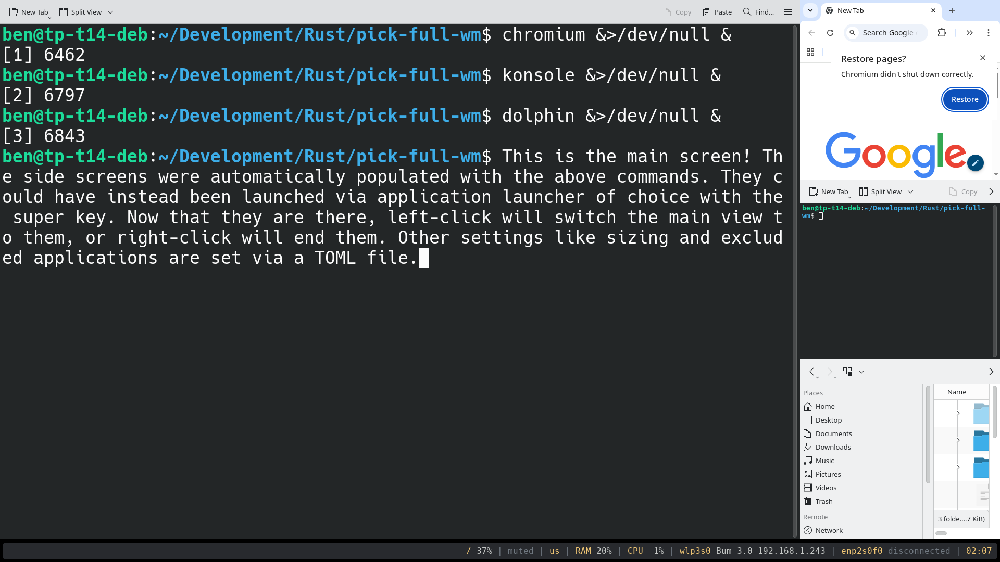

# pick-full-wm

`pick-full-wm`: an [x11](https://en.wikipedia.org/wiki/X_Window_System) window manager written in [Rust](https://rust-lang.org/) with the [x11 crate](https://crates.io/crates/x11)'s [xlib](https://www.x.org/releases/current/doc/libX11/libX11/libX11.html) bindings.

The primary workflow is to focus on one nearly full screen window at a time, with the ability to quickly switch to other windows preview-able on the side of the screen.

The name is lightly inspired by [Minecraft](https://www.minecraft.net/en-us)'s ["Pick Block"](https://minecraft.fandom.com/wiki/Controls) key-binding that allows the user to instantly switch to any visible block.

# Screenshot

# Usage

An x11 window manager is built into a single executable, so should work from a standardly built Rust file. Simply put, a `cargo run --release` should build you a working version of `pick-full-wm` at `/your/repo/target/release/pick-full-wm`.

There two primary ways (that I know of) to launch into `pick-full-wm`.

The first is via an appropriate [`.xinitrc` file from a TTY session via the [`startx`](https://manpages.debian.org/buster/xinit/startx.1.en.html): it should be placed directly at your user folder (`~` / `/home/username/`). An example `.xinitrc` is found in the root of this repository.

The second is from a display manager such as [`SDDM`](https://github.com/sddm/sddm), which looks for an appropriate [`.desktop` file](https://wiki.archlinux.org/title/Desktop_entries) in `/usr/share/xsessions/`, and can be loaded from some window manager menu (bottom left in SDDM's interface). An example `pick-full.desktop` is found in the root of this repository.

The next layer is configuring your `settings.toml` file. There is an example in the root of this repository, but `pick-full-wm` will look for it in `~/.config/pick-full-wm/`, so copy it there and start editing. The current defaults are reliant upon [rofi](https://github.com/davatorium/rofi) as an application launcher and [polybar](https://github.com/polybar/polybar) as a status bar, but are used simply and thus should hopefully be easily swappable.

# Features and TODOs

- [x] Splits area in "main" and "side"
- [x] "Side" area auto lays out all non-main windows
- [x] Window for "main" area swappable with left click
- [x] "Side" windows close-able with right click
- [x] Configurable `settings.toml` from user `.config` folder
- [x] Set-able list of startup applications
- [x] Set-able list of applications to exclude from managing
- [x] Set-able "launcher" application to run with Super key
- [x] Set-able size of "main" area via percent or pixels
- [ ] Implementation of x11 error handling
- [ ] Some implementation of virtual workspaces
- [ ] Built-in multi-monitor support
- [ ] Keyboard options for window switching
- [ ] Integration with "cargo deb"
- [ ] Further customization, such as positioning
- [ ] Work with Extended Window Manager Hints
- [ ] Support for screenshot and capture tools

Some other bigger considerations are switching from the `x11` crate to the [`x11rb`](https://crates.io/crates/x11rb) crate, and implementing a kind of preview system for side windows (instead of doing true direct changes to the size and position). These are TBD in terms of even desired or not.

# Credit

This was written by Benjamin Massey benjamin.w.massey@gmail.com
